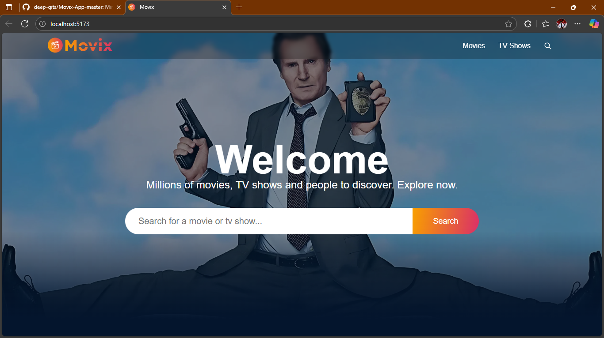
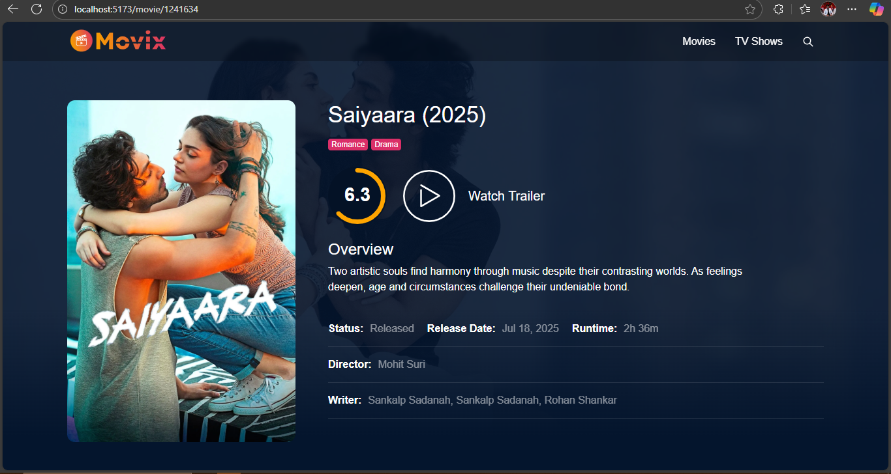

# 🎬 Movix App

Movix is a sleek, responsive movie and TV show browsing web app built using **React.js** and **Vite**, with dynamic content fetched from an API. It offers a Netflix-style UI/UX for discovering trending, popular, and upcoming movies and series.

## 🚀 Features

- 🔍 Search movies and TV shows
- 📊 View trending, popular, and top-rated content
- 🎞️ Watch trailers via embedded videos
- 📱 Fully responsive design
- 🌗 Dark mode inspired UI
- 🌀 Smooth carousel and lazy loading
- 🔧 Modular & reusable components

## 📸 Screenshots






## 🛠️ Tech Stack

- ⚛️ React.js (with Hooks & Functional Components)
- ⚡ Vite.js
- 🎨 SCSS for styling
- 📦 Axios for API calls
- 🔁 React Router DOM
- 🎬 TMDB API for movie data

## 📁 Project Structure

```
Movix-App/
├── public/
├── src/
│   ├── components/
│   ├── pages/
│   ├── hooks/
│   ├── utils/
│   └── App.jsx
├── index.html
├── package.json
└── vite.config.js
```

## 🧪 Installation & Setup

```bash
# Clone the repository
git clone https://github.com/deep-gits/Movix-App.git
cd Movix-App

# Install dependencies
npm install

# Add your API key (TMDB)
touch .env
# Then add: VITE_APP_TMDB_TOKEN=your_tmdb_api_token_here

# Run the app
npm run dev
```

## 🔗 Live Demo

> Check out the live version of the Movix App:

[**🌐 Click here to view the Live Demo**](https://codemovix-app.netlify.app/)

## 📄 License

This project is licensed under the [MIT License](LICENSE).

---

## 🙋‍♂️ Author

**Deepak Saraswat**

- GitHub: [deep-gits](https://github.com/deep-gits)
- LinkedIn: [https://linkedin.com/in/deepak-saraswat](https://linkedin.com/in/deepak-saraswat)
